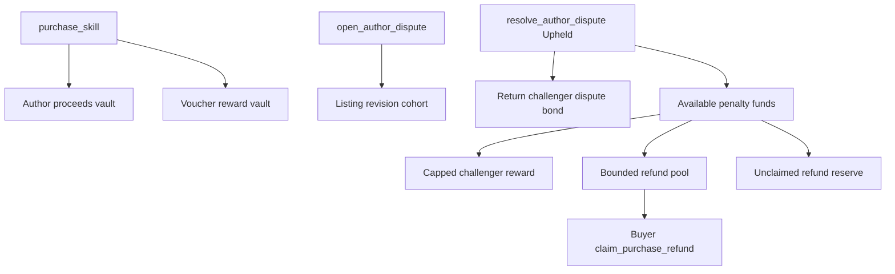

# Milestone 13 Escrow And Refund Plan

## Recommendation
Use the user’s preferred direction with two explicit defaults:

- **Author proceeds escrow:** revision-scoped, configurable withdrawability, with the initial lock set to `0` seconds. This gives us the correct custody and account model now without forcing delayed author withdrawals on devnet. A nonzero value can become a mainnet launch parameter later.
- **Refunds:** bounded, claim-based refund pools. An upheld paid-skill dispute does not promise a full refund unless the pool can fund it. The successful challenger gets their dispute bond returned plus a capped reward before the remaining eligible funds are allocated to purchaser claims.

The key distinction is **instant withdrawability, not instant direct payout**. With lock `0`, a successful purchase can make author proceeds withdrawable immediately, but the purchase instruction still pays into a program-owned proceeds vault first. That avoids the current rent/ATA failure mode and keeps settlement auditable. Voucher rewards can remain claimable through the reward vault, but they should be revision-aware and freezeable for the disputed cohort before they are used as refund or slashing capacity.

This keeps the invariant clean: no instruction loops over buyers, no purchase-time dependency on the author wallet, and no hidden promise that the protocol can refund funds already withdrawn.

## Current State To Replace
The current [`purchase_skill`](file:///Users/andysustic/Repos/agent-reputation-oracle/programs/agentvouch/src/instructions/purchase_skill.rs) transfers the author share directly from the buyer ATA to the author ATA, and the voucher share to `SkillListing.reward_vault`:

```89:115:/Users/andysustic/Repos/agent-reputation-oracle/programs/agentvouch/src/instructions/purchase_skill.rs
    token::transfer_checked(
        CpiContext::new(
            ctx.accounts.token_program.to_account_info(),
            TransferChecked {
                from: ctx.accounts.buyer_usdc_account.to_account_info(),
                mint: ctx.accounts.usdc_mint.to_account_info(),
                to: ctx.accounts.author_usdc_account.to_account_info(),
                authority: ctx.accounts.buyer.to_account_info(),
            },
        ),
        author_share_usdc_micros,
        ctx.accounts.usdc_mint.decimals,
    )?;

    token::transfer_checked(
        CpiContext::new(
            ctx.accounts.token_program.to_account_info(),
            TransferChecked {
                from: ctx.accounts.buyer_usdc_account.to_account_info(),
                mint: ctx.accounts.usdc_mint.to_account_info(),
                to: ctx.accounts.reward_vault.to_account_info(),
                authority: ctx.accounts.buyer.to_account_info(),
            },
        ),
        voucher_pool_usdc_micros,
        ctx.accounts.usdc_mint.decimals,
    )?;
```

[`Purchase`](file:///Users/andysustic/Repos/agent-reputation-oracle/programs/agentvouch/src/state/purchase.rs) is currently keyed only by buyer and listing, so it is not version/revision-aware. [`docs/USDC_NATIVE_MIGRATION.md`](file:///Users/andysustic/Repos/agent-reputation-oracle/docs/USDC_NATIVE_MIGRATION.md) already scopes M13 to version-pinned purchase identity, escrowed author proceeds, claim-based refunds, and legacy entitlement compatibility.

## Protocol Design
Add revision-scoped settlement rather than trying to append all custody state to `SkillListing`.

- Extend `SkillListing` with a `current_revision: u64` and a content identity snapshot such as `skill_uri_hash: [u8; 32]`, incrementing revision on URI/version-changing updates.
- Add a new `ListingSettlement` account seeded by `['listing_settlement', skill_listing, revision]`.
- Add a program-controlled `author_proceeds_vault` per settlement, seeded by `['author_proceeds_vault', listing_settlement]`.
- Keep the existing `reward_vault` path for voucher rewards so author escrow, voucher rewards, treasury, and refund pools remain inspectable.
- Change new `Purchase` PDAs to include revision: `['purchase', buyer, skill_listing, revision]`.
- Preserve legacy purchase entitlement reads for old `['purchase', buyer, skill_listing]` PDAs, but mark those purchases non-refundable unless a later migration explicitly maps them into a revision cohort.

Add or update instructions:

- `initialize_listing_settlement` for existing listings and as a reusable path for new revisions.
- `purchase_skill` to transfer the author share into `author_proceeds_vault`, transfer voucher share into `reward_vault`, and write revision/content snapshots into `Purchase`.
- `withdraw_author_proceeds` for authors to withdraw available proceeds after `author_proceeds_lock_seconds`; default starts at `0`.
- `create_refund_pool` or an expanded `resolve_author_dispute` path that, on upheld paid disputes, creates/funds a bounded refund pool for one listing revision cohort.
- `claim_purchase_refund` for buyers to claim at most their purchase price, limited by the refund pool allocation.
- Defer automatic refund-pool sweeping in M13. If a claim window is used, expired funds should remain in a dedicated refund reserve or unclaimed-refund vault until a later governance/treasury policy explicitly defines where they can move.

Config migration:

- Add config fields through an explicit migration/realloc instruction rather than relying on old config size assumptions.
- Proposed fields: `author_proceeds_lock_seconds`, `refund_claim_window_seconds`, `challenger_reward_bps`, `challenger_reward_cap_usdc_micros`, and optional `refund_reserve_bps` if we decide to reserve part of slashed funds.
- Initial devnet defaults: `author_proceeds_lock_seconds = 0`; challenger reward capped; refund claim expiry either disabled or long-windowed with no automatic treasury sweep; full values set in docs before mainnet.

## Policy Deep Dive
`author_proceeds_lock_seconds = 0` should not mean the buyer’s purchase instruction sends USDC directly to the author. It should mean the author can immediately call `withdraw_author_proceeds` once the purchase has landed in the program-owned vault and no freeze condition applies. That gives authors nearly instant access while preserving separate accounting and avoiding payout-wallet edge cases.

Vouchers are different. The existing design already routes their 40% share into the listing reward vault and lets them claim later. M13 should keep that vault-based model rather than pushing voucher payments during purchase. If voucher rewards are part of paid-skill dispute liability, the implementation needs revision-scoped reward accounting or a dispute freeze that prevents the disputed cohort’s unclaimed voucher rewards from being drained before resolution.

“Claim-based bounded purchaser refunds” means:

- **Claim-based:** each eligible buyer must submit a `claim_purchase_refund` transaction. The resolver creates/funds the pool; it does not loop through every buyer.
- **Cohort-bounded:** only purchases for the disputed listing revision/version are eligible.
- **Per-purchase bounded:** a buyer can never receive more than the USDC they paid for that purchase.
- **Pool-bounded:** total refunds cannot exceed the USDC actually placed in the refund pool.
- **Duplicate-bounded:** one refund claim per eligible purchase, tracked by a refund claim PDA.
- **Time/policy-bounded:** the claim window is explicit. For M13, unclaimed funds should not automatically become treasury revenue; they should remain in a refund reserve until a later policy decides otherwise.

## Refund Waterfall
For upheld paid disputes, do not loop through buyers during resolution. Create a pool and let buyers claim.



Recommended waterfall:

- Return the challenger’s dispute bond from the dispute bond vault first. This is not a reward; it is their collateral coming back.
- Compute a successful challenger reward from available penalty funds with both bps and absolute cap. This prevents a single report from draining the entire buyer refund pool.
- Fund the purchaser refund pool from remaining eligible funds, starting with still-held author proceeds for that listing revision, then any slashed author bond and later voucher-slash funds included in the resolution accounts.
- Keep residual refund funds in a dedicated unclaimed-refund reserve by default. Do not treat unclaimed buyer restitution as protocol revenue in M13.
- If the pool is insufficient, claims are pro rata or first-come against a per-purchase cap, depending on the final UX choice. I recommend pro rata if we can store `total_eligible_purchase_usdc_micros`; otherwise first-come bounded claims are simpler but less fair.

## Web, API, And CLI Impact
Update purchase builders and account metas in:

- [`web/hooks/useMarketplaceOracle.ts`](file:///Users/andysustic/Repos/agent-reputation-oracle/web/hooks/useMarketplaceOracle.ts)
- [`web/hooks/useReputationOracle.ts`](file:///Users/andysustic/Repos/agent-reputation-oracle/web/hooks/useReputationOracle.ts)
- [`packages/agentvouch-cli/src/lib/solana.ts`](file:///Users/andysustic/Repos/agent-reputation-oracle/packages/agentvouch-cli/src/lib/solana.ts)

Update server verification and entitlement handling in:

- [`web/lib/directPurchaseVerification.ts`](file:///Users/andysustic/Repos/agent-reputation-oracle/web/lib/directPurchaseVerification.ts)
- [`web/lib/usdcPurchases.ts`](file:///Users/andysustic/Repos/agent-reputation-oracle/web/lib/usdcPurchases.ts)
- [`web/app/api/skills/[id]/purchase/verify/route.ts`](file:///Users/andysustic/Repos/agent-reputation-oracle/web/app/api/skills/%5Bid%5D/purchase/verify/route.ts)
- [`web/app/api/skills/[id]/raw/route.ts`](file:///Users/andysustic/Repos/agent-reputation-oracle/web/app/api/skills/%5Bid%5D/raw/route.ts)

DB additions should track settlement/refund state without breaking old entitlement rows:

- Add receipt fields for `listing_revision`, `content_identity`, `settlement_pda`, `author_proceeds_vault`, `refund_status`, and `legacy_refund_eligible`.
- Add a refund claims table keyed by purchase/receipt and buyer for web display and idempotent API behavior.
- Keep raw downloads authorized by successful purchases even after a refund unless we explicitly choose entitlement revocation; default should be **refund does not retroactively delete the agent’s local access**, but refunded purchases can be flagged as refunded in APIs.

UI additions:

- Author listing management: show escrowed, withdrawable, locked, and withdrawn USDC totals; add withdraw action.
- Buyer purchase history or skill detail: show refund eligibility, claim deadline, pool balance, claim status, and claim action.
- Dispute resolver UI: show estimated challenger return/reward and refund pool funding before resolution.

## Docs And Public Contract
Update docs only after implementation behavior exists:

- [`docs/ARCHITECTURE.md`](file:///Users/andysustic/Repos/agent-reputation-oracle/docs/ARCHITECTURE.md): replace direct author payout wording and examples.
- [`README.md`](file:///Users/andysustic/Repos/agent-reputation-oracle/README.md): move marketplace payout escrow from “not yet built” once shipped.
- [`web/public/skill.md`](file:///Users/andysustic/Repos/agent-reputation-oracle/web/public/skill.md): describe author withdraw and refund claim behavior for agents.
- [`docs/MAINNET_READINESS.md`](file:///Users/andysustic/Repos/agent-reputation-oracle/docs/MAINNET_READINESS.md) and [`docs/PRODUCTION_RUNBOOK.md`](file:///Users/andysustic/Repos/agent-reputation-oracle/docs/PRODUCTION_RUNBOOK.md): add custody monitoring, refund pool sweeps, stuck withdraw/refund incident handling, and mainnet parameter gates.

## Verification
Run protocol and generated artifact checks after Anchor changes:

```bash
NO_DNA=1 anchor build
NO_DNA=1 anchor test
npm run generate:client
```

Run app and package checks:

```bash
npm test --workspace @agentvouch/web
npm test --workspace @agentvouch/cli
npm run build --workspace @agentvouch/web
npm run smoke:flow-surface
```

Run devnet checks only after explicit approval for live writes:

```bash
npm run smoke:devnet-usdc
npm run smoke:devnet-usdc -- --apply
```

Add focused tests for:

- Purchase sends author share to escrow, not author ATA.
- Author withdraw succeeds with lock `0` and fails while locked or frozen by an open dispute.
- Purchase PDA includes listing revision and old v0.2 purchase PDA remains readable as a legacy entitlement.
- Upheld paid dispute returns challenger bond, pays capped challenger reward, funds a bounded refund pool, and never loops buyers.
- Refund claims are capped, duplicate-safe, deadline-aware, and cannot exceed pool balance.
- Raw downloads still accept valid purchases and clearly mark refunded/non-refundable legacy state.