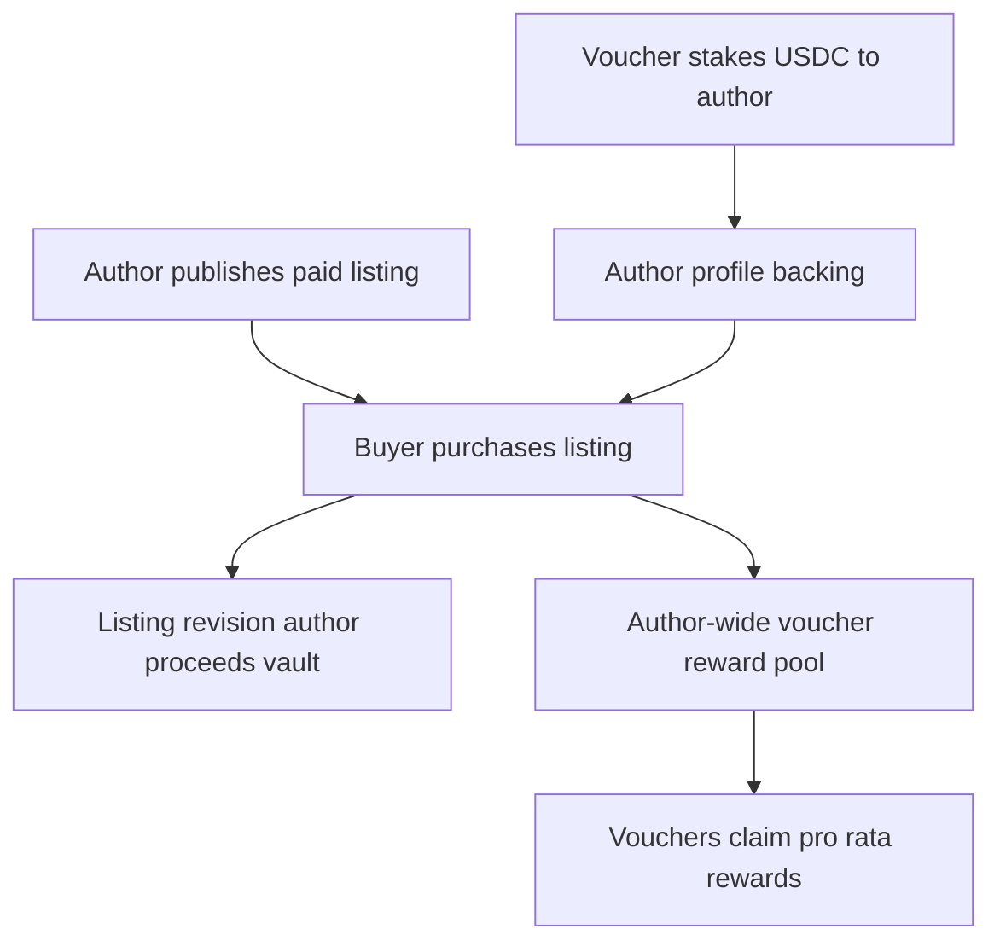

# Purchase Backing Fix Plan

## Diagnosis
`custom program error: #6004` maps to `PurchaseError::NoActiveRewardStake` in `[programs/agentvouch/src/instructions/purchase_skill.rs](programs/agentvouch/src/instructions/purchase_skill.rs)`:

```111:114:programs/agentvouch/src/instructions/purchase_skill.rs
    require!(
        ctx.accounts.skill_listing.active_reward_stake_usdc_micros > 0,
        PurchaseError::NoActiveRewardStake
    );
```

The specific skill is migrated and decoded correctly now, but its listing-level backing is zero:

- Skill DB id: `3f2d798d-b5f5-479c-8478-1967eae33a11`
- On-chain listing: `DiurKxSthrty4yfPDmqaoxuzDLm4G3232pe93oxDf67m`
- Listing `totalDownloads`: `0`
- Listing `activeRewardStakeUsdcMicros`: `0`
- Listing `activeRewardPositionCount`: `0`
- Author profile `totalVouchStakeUsdcMicros`: `5_000_000`
- Active vouch: `7Cbe5SFExZ4xkowzNQbHf2nvhvzjZasWzoMAnpdcTCk2`
- Vouch `linkedListingCount`: `0`
- Expected `ListingVouchPosition`: absent

So the author has 5 USDC author-wide backing, but it has not been linked to this listing. Paid purchases require listing-linked backing so voucher revenue can be accounted against the listing reward index.

The design mismatch is the real problem: the product says the author is backed, while the protocol says each listing must be separately backed. That adds hidden setup work and makes a valid-looking paid purchase fail.

## Target Design

Author-wide backing should make every paid listing by that author purchasable.



Keep listing/revision settlement for purchase identity, author proceeds, disputes, and refunds. Remove listing-linked vouch positions from the normal purchase path.

## Protocol Plan

1. Replace the purchase backing invariant.
- In `[programs/agentvouch/src/instructions/purchase_skill.rs](programs/agentvouch/src/instructions/purchase_skill.rs)`, replace `skill_listing.active_reward_stake_usdc_micros > 0` with an author-wide check against the author profile or a dedicated author reward state.
- Keep paid purchases blocked only when the author has no active vouch backing.
- Update the error name/message from listing-specific language to author-wide language, for example `NoActiveAuthorBacking`.

2. Move voucher reward accounting to author-wide state.
- Add an author-scoped reward index to `[programs/agentvouch/src/state/agent_profile.rs](programs/agentvouch/src/state/agent_profile.rs)` or introduce a dedicated `AuthorRewardPool` account if keeping `AgentProfile` smaller is cleaner.
- On `purchase_skill`, send the voucher share to an author-wide reward vault and increment the author-wide reward index using total active vouch stake.
- On vouch creation, store the voucher’s entry index so it does not earn past rewards.
- On voucher claim, calculate pending rewards from the author-wide index instead of a `ListingVouchPosition`.

3. Deprecate listing-specific reward positions.
- Stop requiring `ListingVouchPosition` accounts for paid purchases.
- Keep `link_vouch_to_listing`, `unlink_vouch_from_listing`, and listing position fields only if needed for devnet migration or legacy cleanup; otherwise remove them from the active product surface.
- Do not build UI for manual listing linking.

4. Preserve settlement and dispute semantics.
- Keep `ListingSettlement`, `Purchase`, `RefundPool`, and `RefundClaim` revision-scoped.
- Keep author proceeds in the listing revision author proceeds vault.
- For disputes, keep author-bond-first liability and then slash author-wide active vouches if needed; do not depend on per-listing links for buyer purchase eligibility.

## Web/API/CLI Plan

1. Update the read model.
- In `[web/lib/onchain.ts](web/lib/onchain.ts)` and skill API routes, expose author-wide backing as the paid-listing purchasability signal.
- Remove or hide listing-level `activeRewardStakeUsdcMicros` from user-facing purchase decisions.
- Keep author-wide backing labels consistent across `[web/app/author/[pubkey]/page.tsx](web/app/author/[pubkey]/page.tsx)`, `[web/app/skills/[id]/page.tsx](web/app/skills/[id]/page.tsx)`, and `[web/app/skills/page.tsx](web/app/skills/page.tsx)`.

2. Update purchase preflight.
- Add a preflight status for missing author backing, not missing listing backing.
- Surface a direct message: `This author needs active vouch backing before paid purchases are available.`
- Keep fresh on-chain purchase checks in the action path.

3. Update CLI behavior.
- Update `[packages/agentvouch-cli](packages/agentvouch-cli)` purchase builders for any new account metas, reward vaults, or claim instructions.
- Keep CLI output focused on author backing, purchase price, and settlement vaults.

## Migration Plan

1. Decide whether to migrate in place or reset devnet fixtures.
- In-place migration: add a migration instruction for new author reward fields/vaults and initialize voucher entry indexes.
- Devnet reset path: create fresh author/vouch/listing fixtures under the new model if existing reward accounting is too awkward to preserve.

2. For the known failing listing:
- Do not solve the product issue by linking `7Cbe5SFExZ4xkowzNQbHf2nvhvzjZasWzoMAnpdcTCk2` to `DiurKxSthrty4yfPDmqaoxuzDLm4G3232pe93oxDf67m` unless we need a temporary devnet unblock.
- Under the target design, the existing 5 USDC author backing should make the listing purchasable without a listing-link transaction.

## Verification

- Run Anchor tests covering paid purchase with author-wide backing and no `ListingVouchPosition`.
- Add reward-claim tests for multiple vouchers, late vouches, and zero backing.
- Run `anchor build`, regenerate IDL/types, sync `[web/agentvouch.json](web/agentvouch.json)`, and regenerate the web client.
- Run web/API/CLI targeted tests for purchase preflight and purchase builders.
- Run `npm run build` in `[web](web)`.
- On devnet, verify the failing skill can be purchased because the author has 5 USDC backing, without manually linking the vouch to the listing.