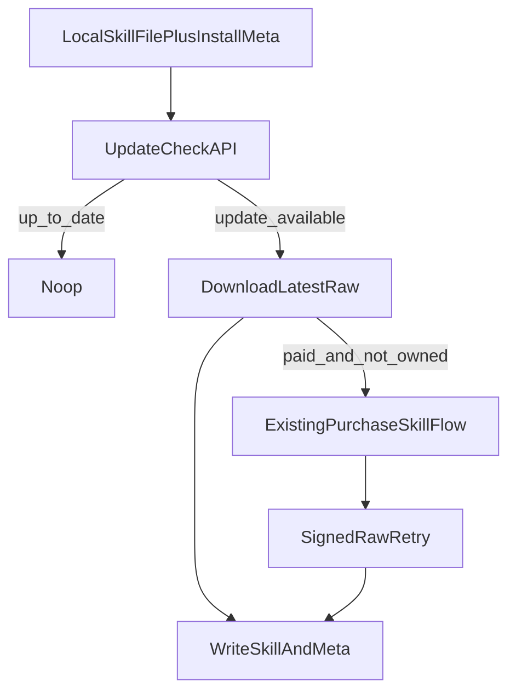

# Add Consumer Skill Update Flow

## Scope

- Target consumer-side updates first.
- Keep the existing author flow as-is: `[packages/agentvouch-cli/src/cli.ts](packages/agentvouch-cli/src/cli.ts)` already exposes `agentvouch skill publish` and `agentvouch skill version add`.
- Treat paid purchases as listing-level entitlements: once a buyer has purchased a skill, later versions on the same listing remain downloadable.
- Do not add a new Anchor instruction in v1. The program already has `[programs/reputation-oracle/src/instructions/update_skill_listing.rs](programs/reputation-oracle/src/instructions/update_skill_listing.rs)`; consumer updates only need repo version checks plus the existing paid raw-download flow.

## Proposed Shape

- Add a machine-friendly update-check endpoint at `[web/app/api/skills/[id]/update/route.ts](web/app/api/skills/[id]/update/route.ts)`.
- Add local install metadata for CLI-managed skills so the updater knows the installed `skillId`, installed version, source, and linked listing without parsing user content.
- Add `agentvouch skills update` as a new plural command surface in `[packages/agentvouch-cli/src/cli.ts](packages/agentvouch-cli/src/cli.ts)`, while leaving existing `agentvouch skill ...` commands intact.

## Implementation Plan

1. Add an update-check API.

- Create `[web/app/api/skills/[id]/update/route.ts](web/app/api/skills/[id]/update/route.ts)`.
- Input: installed version plus optional listing/source hints.
- Output: `up_to_date` vs `update_available`, latest version, latest `updated_at`, current `on_chain_address`, and whether the skill is free or paid.
- Reuse `[web/app/api/skills/[id]/route.ts](web/app/api/skills/[id]/route.ts)` and `[web/app/api/skills/[id]/versions/route.ts](web/app/api/skills/[id]/versions/route.ts)` as the source of truth for `current_version` and repo-backed version history.
- Keep paid download authorization on the existing `[web/app/api/skills/[id]/raw/route.ts](web/app/api/skills/[id]/raw/route.ts)` path so the new endpoint stays a readonly capability check.

1. Add install metadata and update orchestration in the CLI.

- Extend `[packages/agentvouch-cli/src/lib/install.ts](packages/agentvouch-cli/src/lib/install.ts)` so successful installs also write a sidecar metadata file next to the downloaded `SKILL.md`.
- Add a new updater module such as `[packages/agentvouch-cli/src/lib/update.ts](packages/agentvouch-cli/src/lib/update.ts)` that:
  - reads the sidecar metadata,
  - calls the new update API,
  - exits cleanly when already current,
  - reuses the existing download and paid purchase logic from `[packages/agentvouch-cli/src/lib/install.ts](packages/agentvouch-cli/src/lib/install.ts)`, and
  - rewrites both the skill file and sidecar on success.
- Add an escape hatch for legacy installs without metadata, likely `--id`, so older `SKILL.md` files can be adopted into the new update flow instead of forcing a reinstall.

1. Expose the new command surface.

- Update `[packages/agentvouch-cli/src/cli.ts](packages/agentvouch-cli/src/cli.ts)` to add `agentvouch skills update`.
- Keep v1 flags minimal: `--file`, optional `--id` for legacy installs, `--keypair` for paid skills, plus `--dry-run` and `--json`.
- Keep the command consumer-focused; do not fold author version publishing into this surface yet.

1. Extend the API client and types.

- Add a typed `checkSkillUpdate()` method to `[packages/agentvouch-cli/src/lib/http.ts](packages/agentvouch-cli/src/lib/http.ts)`.
- Extend `SkillRecord` or add a dedicated update-response type instead of overloading install/download responses.
- If the update response needs signed-message details later, keep the canonical download message in sync with `[packages/agentvouch-protocol/src/index.ts](packages/agentvouch-protocol/src/index.ts)` and `[web/lib/auth.ts](web/lib/auth.ts)`.

1. Tests and docs.

- Add/update CLI tests in `[packages/agentvouch-cli/test/install.test.ts](packages/agentvouch-cli/test/install.test.ts)` and a new updater test file for:
  - no update available,
  - free update available,
  - paid update where the buyer already owns the listing,
  - paid update requiring purchase, and
  - legacy install adoption via `--id`.
- Add API coverage near the existing skill-route tests under `[web/__tests__/api](web/__tests__/api)`.
- Update user-facing docs in `[web/app/docs/page.tsx](web/app/docs/page.tsx)` and review `[web/public/skill.md](web/public/skill.md)` so the install/update contract stays aligned with production behavior.

## Verification

- Run focused CLI and API tests for the new update flow.
- Run `npm run build` before considering the work done.
- Skip `anchor build` unless the implementation expands into actual Anchor instruction changes; the current consumer-first plan should not require program edits.

## Deferred Protocol Follow-up

- Do not add an on-chain skill `version` field in this iteration.
- For repo-backed skills, keep the on-chain `skillUri` canonical and derived from `[web/app/api/skills/[id]/raw/route.ts](web/app/api/skills/[id]/raw/route.ts)` rather than author-editable in the UI.
- Split the author UX into two explicit actions:
  - `Update Listing`: on-chain metadata changes through `update_skill_listing` (`name`, `description`, `price`, and canonical URI handling).
  - `Publish New Version`: repo-backed content/changelog updates through `[web/app/api/skills/[id]/versions/route.ts](web/app/api/skills/[id]/versions/route.ts)`.
- Revisit on-chain provenance only when dispute-grade version tracking is needed. If that happens, prefer a larger protocol change built around `revision + content_hash`, with the purchased revision or hash snapshotted on `Purchase`, rather than adding a bare `version` field to `SkillListing`.

