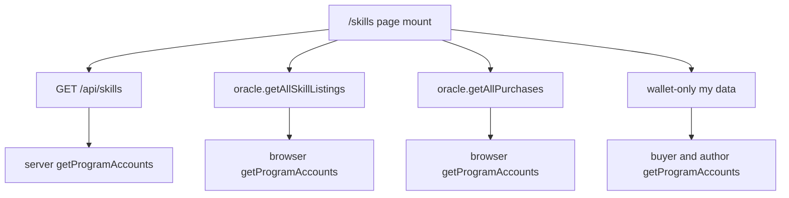
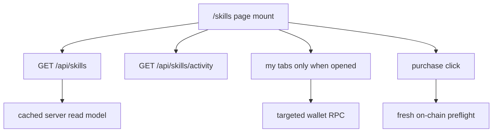

# Skills Browse Cleanup Plan

## Goal
Make `/skills` fast on reload by ensuring the browse grid renders from HTTP/API data first, with live Solana RPC reserved for user-specific tabs and purchase/withdraw actions.

Current slow path:

Target path:

## Implementation Plan

1. Establish a baseline before changing behavior.
- Use the current `/skills` route to record which HTTP requests and Solana RPC calls fire for disconnected reload, connected reload, and switching to `my-purchases` / `my-listings`.
- Confirm the target: disconnected browse should not call browser-side `getProgramAccounts`; connected browse should render before buyer-specific checks finish.

2. Make `[web/app/skills/page.tsx](web/app/skills/page.tsx)` API-first.
- Remove mount-time dependency on `oracle.getAllSkillListings()` for the browse grid.
- Use the `/api/skills` response as the canonical marketplace list, including listing public keys and purchase metadata already available from the API.
- Defer `loadMyData()` until a connected wallet opens `my-purchases` or `my-listings`.
- Stop calling `oracle.getAllPurchases()` from `loadFeed`; use `[web/app/api/skills/activity/route.ts](web/app/api/skills/activity/route.ts)` for recent activity and lazy-load it after the grid renders.

3. Reduce buyer-specific API RPC cost.
- In `[web/app/api/skills/route.ts](web/app/api/skills/route.ts)`, avoid per-row live purchase checks during the main browse fetch when possible.
- Batch on-chain purchase status checks for visible listing candidates, or move them to a small follow-up endpoint so the grid is not blocked by wallet-specific state.
- Keep purchase correctness in the action path: `[web/lib/purchasePreflight.ts](web/lib/purchasePreflight.ts)` and purchase builders should still fetch fresh state immediately before submitting a transaction.

4. Add stale listing safeguards.
- In `[web/lib/onchain.ts](web/lib/onchain.ts)`, validate scanned `SkillListing` account sizes/layout before decoding with the M13 IDL.
- Do not render corrupted decoded values like huge `totalDownloads`; either skip legacy-sized accounts from public browse or mark them as requiring operator migration.
- Keep `scripts/migrate-skill-listings-m13.ts` as the operator fix path for devnet/stale listings rather than adding compatibility shims to the UI.

5. Align tests with the new data flow.
- Update `[web/__tests__/api/skills-get-cache.test.ts](web/__tests__/api/skills-get-cache.test.ts)` for the intended cache and buyer-status behavior.
- Add or update a page/source test under `[web/__tests__](web/__tests__)` that prevents reintroducing `getAllSkillListings()` / `getAllPurchases()` on initial `/skills` mount.
- Add stale account decode coverage around `[web/lib/onchain.ts](web/lib/onchain.ts)` so legacy account sizes cannot produce bogus download counts.

6. Verify end to end.
- Run targeted web tests for `/api/skills`, activity, and the `/skills` page data flow.
- Run `npm run build` in `[web](web)`.
- Smoke-test `/skills` locally: disconnected reload, connected reload, browse purchase CTA, `my-purchases`, and `my-listings`.

## Non-Goals

- Do not change the on-chain M13 settlement design.
- Do not add backward compatibility for unmigrated pre-M13 listings beyond safe detection and operator migration.
- Do not remove fresh RPC checks from purchase, refund, withdraw, or author-management actions.