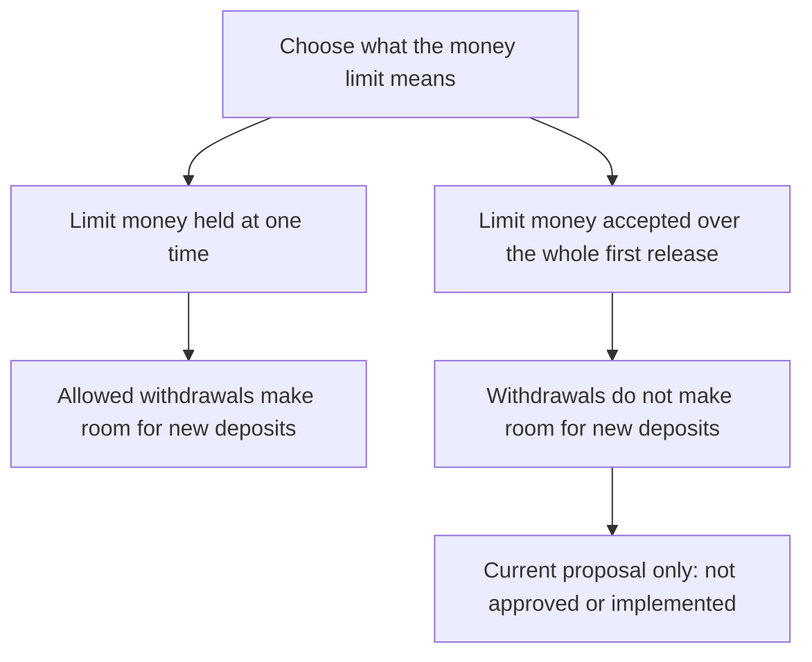
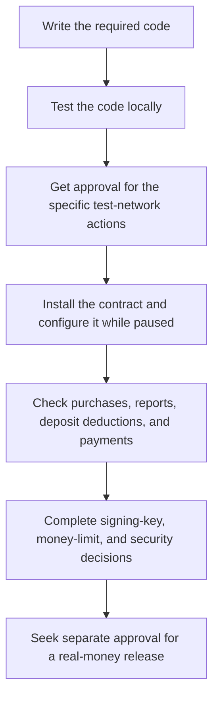

# AgentVouch in plain language

Language guide dated 2026-09-21. This explains the existing documents and a proposed money-limit design. It does not approve a launch, change any money rule, or provide new evidence that a feature is deployed.

## Start here

AgentVouch lets buyers inspect an author's backing deposits and report history before buying a skill. Backers can deposit USDC to support an author. Depending on the purchase and network rules, backers can receive a share of sales and can lose some of their deposits after an upheld report. Backing is not a guarantee that a skill is safe.

- [What work comes next](./ROADMAP.md).
- [What must be checked and approved before real-money use](./MAINNET_READINESS.md).
- [What is written in code versus installed on each network](./CHAIN_CAPABILITY_MAP.md).
- [Recorded progress for the updated Base test-network contract](./BASE_SEPOLIA_A1_STATE.md).
- [Proposed maximum purchase price and total money limit](../.agents/plans/base-alpha-admission-limits.plan.md).

The first small release is sometimes called an **alpha**. That word describes release scope. It does not mean that the release is approved, safe, or already available.

## Three different limits were being called budgets

| Limit                           | What it controls                                                   | Whose money or resource is involved?                        |
| ------------------------------- | ------------------------------------------------------------------ | ----------------------------------------------------------- |
| Maximum purchase price          | How much one paid skill purchase can cost                          | The buyer's USDC                                            |
| Limit on money accepted or held | How much USDC the service may accept or hold under the chosen rule | Buyers' payments and authors' and backers' deposits         |
| Network-fee spending limit      | How much AgentVouch may spend to submit transactions for users     | Funds used by AgentVouch or its sponsor to pay network fees |
| Contract code-size limit        | How much compiled code can be deployed                             | Code bytes, not money                                       |

These are separate controls. A contract code-size limit does not protect customer funds. A network-fee limit does not limit the amount a customer can deposit.

## Choose what the customer-money limit means

### Option 1: maximum money held at one time

The limit applies to money currently held by the contract. When a permitted withdrawal pays money out, that can make room for new deposits. The implementation must correctly account for every amount still owed, including refunds and uncollected payments.

### Option 2: maximum money accepted during the whole first release

The limit counts payments and deposits over the entire first release. Withdrawals do not subtract from that count. This is the current proposal, not an approved rule. It is simpler to implement but can stop a working service from accepting more money.

The examples below use 1,000 USDC only to explain the difference. No limit amount has been approved.

| Event, assuming the withdrawal is permitted | Money currently held in this example | Deposits counted over the whole release |
| ------------------------------------------- | ------------------------------------ | --------------------------------------- |
| Start                                       | 0 USDC                               | 0 USDC                                  |
| A person deposits 100 USDC                  | 100 USDC                             | 100 USDC                                |
| That person withdraws 100 USDC              | 0 USDC                               | 100 USDC                                |
| Another person deposits 100 USDC            | 100 USDC                             | 200 USDC                                |

The second option reserves room for a possible report when a purchase is made. In the proposed updated Base flow, a 10 USDC purchase would use 15 USDC of the limit: the 10 USDC price plus room for the existing 5 USDC report deposit. The buyer pays 10 at checkout, not 15. The 5 is collected only if the buyer submits an eligible report.

When the total limit is used, new purchases and deposits stop. Eligible reports must still be possible while the contract is otherwise unpaused. Existing report decisions and payment claims keep their existing rules. The proposal does not add an automatic pause, a reset button, or a button to increase the limit. Continuing after exhaustion requires a separately approved technical change or release.

This limit would apply to money handled through the protocol. It is not insurance, does not guarantee full refunds, and cannot stop someone from sending unsolicited tokens directly to a public contract.

## What happens to a buyer's money?

A purchase creates a record of who paid and what they bought. Where the existing 60/40 rule applies, 60 percent is recorded for the author and 40 percent for eligible backers. Without eligible external backing, the full purchase amount is recorded for the author. Recording an amount owed and withdrawing that amount are separate actions.

A report does not automatically produce a refund. The report must meet the rules and receive the required decision. In the updated Base paid-report design, an upheld report can deduct backing deposits. The buyer's compensation is limited by the recorded purchase price and the money recovered from those deposits. The report deposit is handled separately under the report rules. AgentVouch does not promise to pay any shortfall from extra funds.

Do not assume every network or contract already supports that updated flow. Use the network feature table and deployment records linked above.

## What the status words mean

| Status wording        | Meaning                                               | What it does not prove                                    |
| --------------------- | ----------------------------------------------------- | --------------------------------------------------------- |
| Proposed              | Someone has written a possible design                 | The owner has approved it                                 |
| Approved              | The named person approved the stated action and scope | Permission for unrelated actions or later stages          |
| Implemented or merged | The code exists in the stated location                | The public contract has changed                           |
| Deployed              | That code has been installed on the stated network    | Users may use it or all required checks passed            |
| Enabled               | The relevant feature has been turned on               | All money flows are correct                               |
| Verified              | The stated check passed under the recorded conditions | A different release, network, or untested flow is correct |
| PENDING               | Work, evidence, or a decision is still missing        | Permission to proceed                                     |
| BLOCKED or NO-GO      | The next restricted action must not proceed           | That all earlier work was wasted                          |

Code reference labels are retained so they still match files and checklists:

| Reference | Plain-language topic                                                     |
| --------- | ------------------------------------------------------------------------ |
| A1        | Deduct backing deposits after an upheld buyer report                     |
| A2        | Report-review approvals, waiting periods, and related refund rules       |
| A3        | Emergency stop for new activity, with protected payments still available |
| A4        | Rules for buyer refunds and other reserved money                         |
| A5        | Testing and security review                                              |

Those labels are not automatic launch blockers by themselves. The current launch-requirements table says which rules apply to the founder-reviewed first release and which apply to a later release with additional governance.

## The launch sequence in ordinary words

This is an overview, not permission to combine deployment stages. The deployment plan still requires its separate approvals. A **testnet** or **devnet** uses test assets. **Mainnet** is the real-money network. A public website can use a test network; a live website is not proof of a mainnet launch.

## Other terms used in the technical records

| Technical term           | Plain-language meaning                                                                                                         |
| ------------------------ | ------------------------------------------------------------------------------------------------------------------------------ |
| Vouch or stake           | USDC deposited to back an author                                                                                               |
| Author bond              | The author's own backing deposit                                                                                               |
| Slashing                 | Deducting some backing USDC after the required report decision                                                                 |
| Resolver                 | The person or service authorized to decide a report                                                                            |
| Custody                  | Who controls funds and who holds the keys that can move them                                                                   |
| Authority or role holder | A wallet or contract permitted to approve a specified action                                                                   |
| Settlement               | Recording what was paid or deciding and recording what is owed; the exact action depends on the section                        |
| Buyer credit             | An amount recorded as owed to the buyer, subject to claim rules and deadlines                                                  |
| Claim or pull payment    | The recipient asks the contract to pay an amount owed to them                                                                  |
| Restitution reserve      | Money reserved for the specified recipient under the report rules; not a guarantee that every buyer will receive a full refund |
| No protocol backstop     | AgentVouch does not guarantee extra funds to make up a refund shortfall                                                        |
| Relayer                  | A service that submits a blockchain transaction for someone else                                                               |
| Paymaster or sponsor     | A service or party that pays a user's network fee under its rules                                                              |
| x402                     | A payment process built into HTTP requests; it is not a separate blockchain                                                    |
| ABI                      | The list and formats of contract functions that apps can call                                                                  |
| Selector                 | The code used to identify a contract function in a transaction                                                                 |
| Smoke test               | A short check of important behavior, not a complete audit                                                                      |
| Rehearsal                | A practice run before the real operation                                                                                       |
| Gate                     | A required check or approval before the next restricted action                                                                 |
| Rollback                 | Returning to a previous safe setup without abandoning existing obligations                                                     |

## Writing rule for future work

Name the user action and outcome first. Keep an internal reference only when it helps locate code or evidence. Write **collect the buyer's approved payment**, not just **execute the credit-claim lifecycle**. Always distinguish a proposal, an approval, written code, a deployed contract, and an enabled feature.
